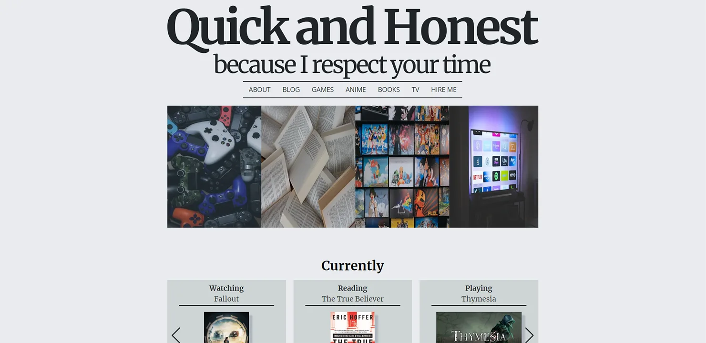

# personal-blog-mern.stack

Visit the website [here](https://www.quickandhonest.com/)

### A blog website

This app is created with mongoDB, expressjs, react and nodejs. Please note that registration is disabled.

Still to do:

- Slug instead of id for the url
- User comments
- Reset Password functionality

It includes the following:

- GET/POST/PUT/DELETE routes for the blogposts
- RTK query from Redux Toolkit for fetching and handling data
- Admin functionality
- JWT for authentication
- Authorization
- React-hook-form for the forms and JOI for frontend and backend validation
- Swiper for the carousel and react-paginate for the pagination
- React-quill for the text editor with the ability to save the text in localStorage
- Images are saved in Cloudinary with Multer
- Some web security stuff: html sanitization, Helmet for setting HTTP response headers
